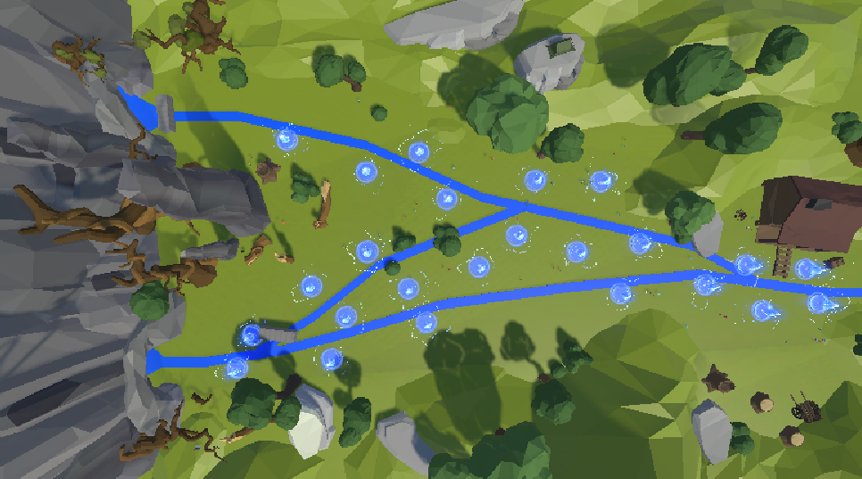

# Surf n' Turf

<a href="https://github.com/AbdulDevHub/SurfNTurf" target="_blank" rel="noreferrer">  
    
</a>

## Overview

This repository contains the code for **Surf n' Turf**, a strategic tower defence game created in Unity by Moonlight Games 🌙. Defend the peaceful county of Clearwater from an invasion of radioactive fish threatening to pollute the nation's only clean water source. Strategically place wildlife and fishermen along the riverbanks to catch the fish before they reach open waters.

**The wildlife has become a bit too wild, as rivers overflow with hazardous fish aplenty. Eradicate the colourful onslaught of sealife and take back the ecosystem!**

### Synopsis

```
An onslaught of invasive fish overruns the ravines into a faraway basin. 
As waves of radioactive fish migrate downstream toward Clearwater's only 
source of clean water, you must construct and upgrade defensive towers 
in the form of fishermen, bears, and birds. Plan your defences wisely, 
manage your resources carefully, and adapt to surprise events like dam 
breaks that open new enemy routes. Can you stop the pollution and save 
the ecosystem before 100 fish reach the clean water?
```

## Features

- **Strategic Tower Placement**  
  Place and upgrade three unique tower types (Birds, Bears, Fishermen) with distinct abilities and specializations.

- **Progressive Wave System**  
  Battle through 20 waves of increasing difficulty with diverse enemy types: Basic, Fast, Hidden, Big, and Swarm variants.

- **Dynamic Map Events**  
  Adapt to environmental changes as dams burst open, revealing new enemy paths and forcing strategic repositioning.

- **Resource Management**  
  Earn fish scales by defeating enemies and decide whether to invest in new towers or upgrade existing ones.

- **Varied Enemy Types**  
  Counter different threats including fast-moving fish, hidden enemies requiring upgraded towers, and massive swarms.

- **Climactic Boss Battle**  
  Face a colossal Radioactive Swarm boss with 200 health in the final wave—the ultimate test of your defences.

- **Tower Synergy System**  
  Combine tower abilities effectively: Fishermen nets trap enemies while Bears and Birds deal area damage.

- **Performance-Based Scoring**  
  Final scores based on remaining health, total fish defeated, scales saved, and completion time.

## Repository Contents

- **Assets**  
  All 3D models, textures, sounds, visual effects, and Unity assets used in the game.

- **Game Scripts**  
  Unity C# scripts handling tower placement/upgrades, enemy pathing, wave management, UI, currency system, and game logic.

- **Playable Version (Desktop Build)**  
  A desktop-ready build of the game that can be downloaded and played locally.

- **Playable Version (Online Build)**  
  An online/browser version of the game (link to be added).

- **Rule Sheet**  
  A comprehensive player guide containing controls, tower stats, enemy types, and gameplay tips.

- **Game Design Document**  
  Detailed design documentation covering mechanics, narrative, playtesting insights, and development process.

## Opening the Source Code

If you wish to open and edit the source code in Unity:

1. Clone this repository
2. Open Unity Hub
3. **Use Unity Editor version [6000.2.12f1](https://unity.com/releases/editor/whats-new/6000.2.12f1#notes)** for full compatibility
4. Add the project folder to Unity Hub and open it

## Controls

- **Mouse Left Click**: Interact with tower placement, upgrade, and UI elements
- **W / A / S / D**: Move the camera view across the map
- **Q / E or Scroll Wheel**: Zoom in and out
- **Esc**: Pause and open the menu

## Team

**Moonlight Games 🌙**

- Joshua Andreou
- Philippe Filiatreault
- Abdul Khan
- Clara Joy Tan

## Credits

Built with Unity and various asset packs. See the Game Design Document for full asset attribution.

---

*Protect Clearwater. Stop the invasion. Become the hero the ecosystem needs.*
